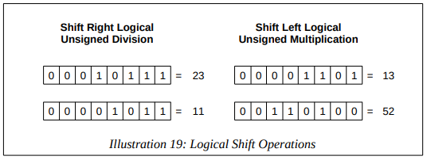
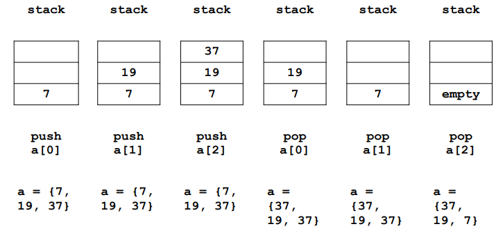
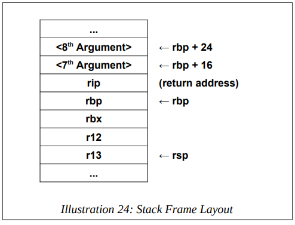

# 컴퓨터를 밑바닥부터 이해해보자 (2) + 리버싱 (1)

## 컴퓨터의 구조와 작동 원리를 간단하게 살펴봅시다 (2)

### 비트 연산

C 언어에서 비트 쉬프트 << 과 >>, ~ 은 내부적으로 shl, shr, not 어셈블리어를 사용한다. 

`shl <dest> <src>`

`<dest> = <dest> << <src>` 의 의미이다. SHift Left 의 줄임말. 1번 쉬프트 하면 2배 커지고 2번 쉬프트하면 2^2 배 커진다. n 번 쉬프트 하면 2^n 배 커진다. 

```assembly
shl ax, 8  
shl eax, cl
```

`shr <dest> <src>`

`<dest> = <dest> >> <src>` 의 의미이다. SHift Right 의 줄임말. 1번 쉬프트 하면 2배 나눠지고 2번 쉬프트하면 2^2 배 나눠진다. n 번 쉬프트 하면 2^n 배 나눠진다. 

```assembly
shr rcx, 32     
shr qword[qNum], cl   
```



### 메모리 관리

사용자가 프로그램을 실행하면 HDD 또는 SSD 에 저장되어 있던 프로그램의 바이너리가 RAM 으로 복사된다. 


    
RAM 에 복사된 프로그램을 프로세스라고 부르는데 CPU 는 RAM 에서 이 프로세스를 읽으면서 명령을 수행한다. 


현대의 컴퓨터는 프로그램을 HDD 또는 SSD 에서 RAM 으로 로드할 때 가상 메모리 시스템으로 관리한다. 64 비트 시스템에서는 `0x0000000000000000` 부터 `0xffffffffffffffff` 까지의 가상 메모리 영역이 하나의 프로세스에 할당된다.
    
즉 실질적인 물리적 주소를 할당하는 것이 아니라 가상의 메모리 영역을 할당하는 것이다. 프로그램 바이너리가 RAM 에 로드될 때 할당되는 가상 메모리는 두 영역으로 나뉜다. 하나는 커널 영역, 하나는 사용자 영역이다. 커널영역은 커널 관련 메모리가 로드되고 시스템 콜을 통해서만 접근할 수 있다.

사용자 영역은 5 등분되서 로드되는데 스택Stack, 힙Heap, BSS 영역, Data 영역, Text 영역이 그것이다. 스택Stack 에는 함수의 인자, 함수의 리턴 주소값, 지역 변수가 로드된다. 힙Heap 에는 동적 할당 메모리(malloc, new 등) 가 저장된다. BSS 영역과 Data 영역에는 전역변수, static 변수 등이 저장되는데 초기화되지 않았거나 0 으로 초기화된 변수들은 BSS 영역에 저장되고 초기화된 변수들은 Data 영역에 저장된다. Text 영역에는 실행될 어셈블리어들이 저장된다. 


위의 그림처럼 가장 낮은 주소부터 Text 영역, Data 영역, BSS 영역, Heap 영역, Stack 영역, 그리고 메인함수의 인자와 환경변수, 가장 높은 주소에 커널 영역이 저장된다. 이 영역들은 모두 가상 메모리 영역이고 주소값도 가상 주소값이다. 게임이든, 문서작업이든, 카카오톡이든 컴퓨터의 어떤 프로그램이라도 이런 식으로 가상 메모리가 할당이 된다. 
    


그리고 그러한 가상 메모리 영역은 위와 같이 적절히 쪼개져서 물리 메모리, 그러니까 실제 메모리에 저장된다. 만약 실제 메모리가 부족할 경우 HDD 또는 SSD 를 사용하게 된다. 가상 메모리를 사용하게 되면 메모리 주소값을 일관되게 사용할 수 있고 만약 RAM 이 부족하면 HDD 또는 SSD 를 사용할 수 있게 된다. `적절히 쪼개진다` 는 것이 구체적으로 어떻게 되는 것인지 설명하려면 한 학기가 필요할테니 그만두자. OS 시간 때 배우시길.

#### 가상 메모리 영역과 물리 메모리 영역 확인해보기 

```c
// https://github.com/nffive/test_virt_memory
#include <stdio.h>
#include <stdlib.h>
#include "libkdump.h"

int data = 5555;
int bss = 0;
int bss2;

void text(){ 1+1 == 2; }

int main(int argc, char * argv[]){
    static char * data2 = "twice";
    int stack = 78;
    int stack2 = 23;
    int * heap = (int *)malloc(sizeof(int));
    int * heap2 = (int *)malloc(sizeof(int));
    char * environment_variable = getenv("PATH");

    printf("Let's check address of each memory section from BOTTOM to TOP.\n");
    printf("Text  section : %p\n", text);
    printf("Data  section : %p\n", &data);
    printf("              : %p\n", &data2);
    printf("BSS   section : %p\n", &bss);
    printf("              : %p\n", &bss2);
    printf("Heap  section : %p\n", heap);
    printf("              : %p\n", heap2);
    printf("Stack section : %p\n", &stack);
    printf("              : %p\n", &stack2);
    printf("Main argument : %p\n", argv);
    printf("Environment   : %p\n", environment_variable);
    printf("All of these are Virtual Address\n\n");

    printf("Let's check physical address(Real Address)!\n");
    void * physical_text = libkdump_virt_to_phys((size_t)text);
    if (physical_text == NULL) {
        puts("\x1b[31mIf you want to see physical memory address, reexecute with root privileges!");
        return 1;
    }
    printf("Text  section : %p\n", physical_text);
    printf("Data  section : %p\n", libkdump_virt_to_phys((size_t)&data));
    printf("              : %p\n", libkdump_virt_to_phys((size_t)&data2));
    printf("BSS   section : %p\n", libkdump_virt_to_phys((size_t)&bss));
    printf("              : %p\n", libkdump_virt_to_phys((size_t)&bss2));
    printf("Heap  section : %p\n", libkdump_virt_to_phys((size_t)heap));
    printf("              : %p\n", libkdump_virt_to_phys((size_t)heap2));
    printf("Stack section : %p\n", libkdump_virt_to_phys((size_t)&stack));
    printf("              : %p\n", libkdump_virt_to_phys((size_t)&stack2));
    printf("Main argument : %p\n", libkdump_virt_to_phys((size_t)argv));
    printf("Environment   : %p\n", libkdump_virt_to_phys((size_t)environment_variable));
    return 0;
}
```

위와 같은 간단한 C 프로그램으로 가상 메모리 영역과 물리 메모리 영역을 확인해보자. 

```shell
git clone https://github.com/nffive/test_virt_memory
cd test_virt_memory
make
sudo ./check_virtual_memory_structure
```

이러한 명령어로 실습을 해볼 수 있다. 

#### 스택 메모리 관리

스택 메모리는 LIFO (Last-In, First-Out) 법칙으로 관리된다. 가장 마지막에 들어온 값이 가장 먼저 제거된다. a = {7, 19, 37} 이라는 배열을 생각해보자. 

```assembly
push a[0]
push a[1]
push a[2]

pop a[0]
pop a[1]
pop a[2]
```

그리고 그 배열에 대하여 위와 같은 6개 명령어를 실행시켰다. 



그러면 스택은 각각의 6개의 명령어마다 위의 그림과 같이 변하고 배열 a 는 {37, 19, 7} 이 된다. push 로 값이 스택에 저장된 후 pop 으로 스택의 가장 위에 있는 값이 제거 되면서 저장되는 것이다. 

`push <op>`

push 명령어는 전달된 값을 스택에 저장한다. push 는 내부적으로 rsp 레지스터를 사용해서 스택의 최상위 주소를 알아내고 그 주소에 값을 저장하게 된다. 그런데 스택에 (64 비트 메모리 시스템에서는!) 8 바이트 값이 저장되니까 스택이 8 만큼 커졌다. 그래서 rsp 에서 8 을 빼준다. 스택의 최상위 주소를 8 만큼 높혀줘야 하기 때문이다.  

그럼 높혀줘야 하는데 8 을 왜 뺄까? [메모리 레이아웃](https://notes.shichao.io/tlpi/figure_6-1.png) 에서도 확인할 수 있듯이 스택은 높은 주소에서 낮은 주소로 자라기 때문이다. 그래서 스택의 밑바닥을 가르키는 rbp 의 값이 스택의 최상위 주소값을 가르키는 rsp 보다 항상 같거나 크다.

```assembly
push rax            ; rax 의 값을 스택에 저장한다. 
push qword [qVal]   ; qVal 의 값을 스택에 저장한다. 
```

`pop <op>`

pop 명령어는 스택의 가장 위에 있는 값을 `<op>` 에 저장하고 스택을 8 만큼 줄여준다. 스택의 가장 위는 rsp 가 가르키고 있으니 결국 rsp 에 있는 값이 가르키는 값을 `<op>` 에 저장한다는 말이다. 그리고 스택을 줄여주어야 하니 rsp 에 8 을 더해준다. 

```assembly
pop rax            
pop qword [qVal]   
```

#### 함수 호출

CPU 가 함수를 호출해서 프로그램의 흐름을 바꿀 때 call 명령어를 쓰고 원래 있던 곳으로 되돌아 갈 때 ret 명령어를 사용한다. 

```c
int add(int a, int b) { return a + b; }
void main(){
    int a = add(1, 2);
    printf("%d\n", a);
}
```

C 프로그램은 내부적으로 call 을 사용해서 add 함수로 뛰고 add 함수가 끝나면 ret 명령어로 다시 main 함수로 되돌아오게 된다. 

`call <location>`

```assembly
call printf
call 0x400421
```

call 이 하는 일은 call 명령어 다음 명령어의 주소값을 스택에 push 하고 `<location>` 으로 점프하는 것이다. 

`ret`

ret 명령어(return) 는 call 명령어가 스택에 저장해놓은 리턴 주소값을 pop 해서 rip 레지스터에 저장한다. 한 마디로 PC 를 바꿔서 되돌아간다는 말이다. 

#### 함수 인자 전달
    
함수에 인자를 전달할 때 차례대로 rdi, rsi, rdx, rcx, r8, r9 가 사용되고 인자가 7개 이상일 경우 7번째 인자부터는 어쩔 수 없이 레지스터보다 좀 더 느린 메모리를 사용한다. 함수의 반환값은 rax 레지스터에 저장된다.

```c
#include <stdio.h>

int add(int n1, int n2, int n3, int n4, int n5, int n6, int n7) {
    int result = n1 + n2 + n3 + n4 + n5 + n6 + n7;
    return result;
}

void main() {
    int result;
    result = add(1, 2, 3, 4, 5, 6, 7);
    printf("%d\n", result);
}
```

위의 `add` 함수의 경우 rdi = 1, rsi = 2, rdx = 3, rcx = 4, r8 = 5, r9 = 6 이 저장되서 전달되고 7 은 메모리에 저장된 채로 전달된다. 그리고 call 명령어가 다음 명령어를 스택에 저장하고 add 함수로 건너 뛴다. add 함수가 끝나면 ret 명령어가 call 이 스택에 저장해놓은 리턴 주소값을 rip 에 저장한다. 



함수가 호출 될 때 이전 함수의 스택 베이스 주소를 복원하기 위해서 rbp 를 push 해서 스택에 저장해둔다. 위와 같은 경우 main 함수가 add 함수를 호출하고 있는데 add 함수가 스택을 사용하기 전에 main 함수에서 사용하던 스택 베이스 주소, 즉 rbp 에 있던 값을 스택에 저장해서 main 함수의 스택을 복원해야 할 때를 대비한다. 

```assembly
push rbp        ; 이전에 있던 함수의 rbp 를 스택에 저장
mov rbp, rsp    ; 스택의 베이스 주소를 스택의 탑 주소와 같게 만듦. 이 시점에서 스택의 크기는 최소 단위 8 바이트가 됨
sub rsp, 0x60   ; 스택의 크기를 0x60 만큼 늘려줌 
```

그래서 일반적인 함수는 위와 같은 어셈블리 코드로 시작된다. 

```assembly
leave
ret
```

함수가 일을 다 마치고 원래의 함수로 되돌아 가야 할 때는 위와 같은 어셈블리 코드로 늘려 놓은 스택을 되돌린 후 이전 함수의 rbp 를 복원한다. 늘려진 스택을 줄이고 원래 함수의 스택 베이스 주소를 복원하는 용도로 leave 명령어가 사용된다. leave 명령어는 다음의 코드와 같은 기능을 한다.

```assembly
mov rsp, rbp    ; rsp 에 rbp 를 대입해서 늘어난 스택을 다시 크기가 최소 단위인 8 바이트 스택으로 만든다. 
pop rbp         ; pop 명령으로 그곳에 남아있던 원래의 함수의 스택 베이스 주소를 rbp 에 복원시킨다. 
```

#### 32 비트 시스템에서의 함수 인자 전달

64 비트 시스템에서는 위와 같이 레지스터로 함수의 인자를 전달하지만 32 비트 시스템에서는 스택을 사용해서 함수의 인자를 전달한다. 그래서 `file` 명령어 등을 통해서 디버깅을 할 때 64 비트용 프로그램인지 32비트용 프로그램인지 확인해야 한다. 만약 32 비트 용 프로그램이라면 다음과 같은 출력을 볼 수 있다.

```shell
$ file crackme0x00a
crackme0x00a: ELF 32-bit LSB executable, Intel 80386, version 1 (SYSV), dynamically linked, interpreter /lib/ld-, for GNU/Linux 2.6.15, BuildID[sha1]=a01d6d16a59c7f0d7ec00ab5454eed2eb22bd20d, not stripped
```

반면 64 비트용 프로그램이라면 다음과 같은 출력이 나타난다.

```shell
$ file test64
test64: ELF 64-bit LSB shared object, x86-64, version 1 (SYSV), dynamically linked, interpreter /lib64/l, for GNU/Linux 3.2.0, BuildID[sha1]=95a71c9bbc3786b1fd05f214d63bce1fc7b3262b, not stripped
```

32 비트 시스템에서는 인자를 차례대로 esp, esp+4, esp+8, ..., esp+4n 의 위치에 저장한 후 `call` 명령어로 함수를 호출한다. 그리고 반환값을 eax 에 저장한다. 

```c
#include <stdio.h>

int add(int n1, int n2, int n3, int n4, int n5, int n6, int n7) {
    int result = n1 + n2 + n3 + n4 + n5 + n6 + n7;
    return result;
}

void main() {
    int result;
    result = add(1, 2, 3, 4, 5, 6, 7);
    printf("%d\n", result);
}
```

이 프로그램을 다시 살펴보자. 이 프로그램을 다음 명령어를 참고해서 32 비트 전용 프로그램으로 컴파일 해보자. 

```shell
$ gcc test.c -m32 -o test
$ file test
```

`-m32` 옵션을 붙혀주면 32 비트용 프로그램으로 컴파일 되는데 

#### 나머지 어셈블리어들은?

http://www.jegerlehner.ch/intel/IntelCodeTable.pdf

이렇게 핵심 어셈블리어를 이해해보았기 때문에 나머지 어셈블리어도 스스로 충분히 이해할 수 있을 것이다. 모르는 어셈블리어가 나오면 구글에 검색해보아도 되고 위의 레퍼런스를 참고해도 된다. 

---

## 리버싱 (1)

### 들어가기전에 16진수 표기법을 살짝 맛보고 들어가기 

n 진수는 한 자리에 0 부터 (n-1) 까지의 숫자까지 나타낼 수 있다. 예를들어 2진수는 한 자리에 0 또는 1 을 나타낼 수 있고 우리가 자주 쓰는 10진수는 한 자리에 0 부터 9 까지의 숫자를 나타낼 수 있다. 그래서 16진수도 한 자리에 0 부터 15 까지 나타낼 수 있는데 아라비아 숫자가 0 부터 9 까지밖에 없기 때문에 10, 11, 12, 13, 14, 15 는 각각 a, b, c, d, e, f 로 나타낸다. 대문자 A, B, C, D, E, F 로 나타내기도 한다. 

컴퓨터에서 숫자 앞에 0x 를 붙히면 heXadecimal, 즉 16진수로 나타내겠다는 뜻이고 0o 을 붙히면 Octal, 즉 8 진수로 나타내겠다는 뜻이다. 

https://ko.wikipedia.org/wiki/%EC%8B%AD%EC%9C%A1%EC%A7%84%EB%B2%95

위 링크에서 16 진수와 10 진수를 대조해보자. 

### 해킹의 어원

https://ko.wikipedia.org/wiki/해킹

http://www.gachonnews.com/news/articleView.html?idxno=4930

본래 거칠게 자르거나 헤집는다는 뜻의 hack 이라는 낱말에 지금의 의미를 부여한 것의 유래는 분명하지 않으나 1948년 매사추세츠공과대학의 모형 기차 제작 동아리인 TMRC에서 전기 기차, 트랙, 스위치를 보다 빠르게 조작하다 라는 의미로 시작됐다. 해킹의 정의는 시간에 따라 변화되어 왔는데 초기에는 '컴퓨터와 컴퓨터간의 네트워크를 자유자재로 다루고 조작하는 행위'를 말했다. 이후 악의적인 행동이 늘어나면서 '다른 컴퓨터 시스템을 침입할 때 파괴적인 계획을 갖고 침입하는 행위'라는 부정적 의미를 갖게 되었으며, 일명 크래킹이라 하였다.

아톰 텍스트 에디터를 해킹해라? : https://flight-manual.atom.io/hacking-atom/

그런데 대상에 대하여 알고 있는 만큼 그것을 "자유자재로 다루고 조작" 할 수 있다. 사실 컴퓨터 뿐만 아니라 어떤 분야든지 알고 있는 만큼 그것을 마음대로 다룰 수 있는 능력이 생긴다. 요리를 할 때도 사람들의 입맛이 무엇이고 그 입맛을 맞추기 위해 재료를 어떻게 손질해야 하는지 알아야 요리를 자유자재로 할 수 있을 것이다. 또 뉴스를 보면 범죄를 저지르면서도 법 망을 요리조리 피해서 속편하게 살아가는 사람들이 있는데 대한민국 법에 대해서 잘 알고 있으니까 그런 식으로 법을 자유자재로 다루면서 법 망을 피해갈 수 있는 것이다. 

컴퓨터에 대해서도 마찬가지인데 컴퓨터가 작동하는 방식과 서로 통신하는 것, 그리고 특정한 프로그램이 어떻게 작동하는지 알고 있는만큼 그것을 "자유자재로 다룰(해킹)" 수 있다. 그래서 해킹의 사전작업은 리버싱으로 프로그램과 컴퓨터와 기타등등을 제대로 이해하는 것이다. 

### 리버싱이란 

https://ko.wikipedia.org/wiki/리버스_엔지니어링

https://www.foo.be/cours/dess-20122013/b/Eldad_Eilam-Reversing__Secrets_of_Reverse_Engineering-Wiley(2005).pdf

역공학 또는 리버싱reversing 이란 리버스 엔지니어링reverse engineering 의 줄임말이다. 공학이란 아이디어와 개념을 물질(최종 제품)로 구현하는 것이라 할 수 있는데, 역공학이란 공학과 정반대로 물질(최종 제품)에서부터 아이디어와 개념을 발견하는 것이다. 

두번째 링크의 저자가 정의하고 있는 리버싱이란 "어떤 소프트웨어의 모든 것에 대하여 이해할 수 있는 도구와 기술들" 이다. 그리고 저자는 정의를 좀 더 확장해서 자기 자신이 만든 프로그램일지라도 몇 일이 지난 후 어떻게 프로그램이 짜여져있는지 잊어버린 후 코드를 다시 살펴보는 것도 리버싱이라고 말한다. 자신이 코드를 어떻게 짰는지 까먹은 후 다시 살펴보는 것도 물질(최종 제품) 으로부터 아이디어와 개념을 발견하려는 시도로 볼 수 있다. 

또한 최근 어떤 해커가 메가스터디 서버를 해킹해서 사용자들의 정보를 탈취했는데 해커는 분명히 메가스터디 서버가 어떻게 작동하는지 알기 위해 리버싱을 하였고 그 리버싱으로 알아낸 개념과 아이디어, 원리들을 기반으로 해킹을 할 수 있었을 것이다. 그래서 비단 어셈블리어를 뒤지고 있는 게 리버싱이 아니라 우리가 알게 된 리버싱의 정의에 따르면 서버에 대하여 여러가지 테스트를 해보는 것도 리버싱이고 자기 자신의 코드를 자기 살펴보는 것도 리버싱인 것이다. 

대상에 대하여 알고 있는 정도와 대상을 자유자재로 다룰 수 있는 정도는 정비례한다. 그리고 리버싱을 많이 하면 할 수록 대상에 대하여 알고 있는 정도가 늘어날 것이고 해킹 할 수 있는 정도(자유자재로 다룰 수 있는 정도)도 늘어난다. 그래서 리버싱에 투자하는 시간이 무한에 가까워질 수록 해킹할 수 있는 범위도 무한히 넓어지지만 우리에게 주어진 시간은 무한하지 않기 때문에, 해킹의 목적에 따라서 필요한 만큼 리버싱을 하는 것도 중요하다. 

### 리버싱 도구

그렇기 때문에 리버싱이란 "대상(프로그램, 서버, 프로토콜 등등)의 작동방식을 이해하는 행위" 인데 지금부터는 비밀번호를 물어보는 프로그램들을 간단하게 해킹해 볼 것이기 때문에 지금은 "비밀번호를 물어보는 프로그램의 작동방식을 이해하는 것" 을 리버싱이라고 생각하자. 그럼에도 불구하고 그 프로그램의 작동방식을 전부 다 알 필요는 없다. 위에서도 언급했지만 시간이 무한하지 않기 때문에 해킹에 필요한 만큼의 작동방식만 이해하면 된다.

그래서 결국에 해킹을 위하여 프로그램의 작동방식을 이해하고 싶은데 프로그램은 실질적으로 눈에 보이지 않는 전자기들로 이루어져있으니 그것들을 볼 수 있게 도와주는 도구들이 필요하다. 그중에서 "무료이면서", "대중적인" 리버싱 도구들이 **gdb** 와 **radare2** 이다. 

https://github.com/tylerha97/awesome-reversing : 여기에서 더 많은 리버싱 정보를 볼 수 있다. 

###### 참고 - awesome 레포지토리에 대해서

> 다양한 IT 분야의 프로그래머들은 자신의 분야에 대한 개쩌는(awesome) 정보들을 한 군데로 수집하기 위해서 awesome-XXXXX 레포지토리들을 제작하기 시작했는데 그 awesome-XXXXX 레포지토리를 한 군데로 모은 것이 [sindresorhus](https://github.com/sindresorhus) 라는 프로그래머의 [awesome 레포지토리](https://github.com/sindresorhus/awesome) 이다. 이 레포지토리는 스타를 11만 1362개(19/7/10 기준) 를 받아서 Github 단일 레포지토리 중에서 [스타 랭킹이 전체 8위](https://gitstar-ranking.com)를 기록했다. 그리고 이 sindresorhus 라는 프로그래머는 총 합산 스타가 402,004 (19/7/10 기준)으로써 전체 Github 유저 중 1위이다. 그 40만개의 스타 중에서 1/4 인 11만개를 awesome 레포지토리가 차지하고 있다. 

### elf 툴 

- GNU 바이너리 유틸리티 : GNU 유틸리티는 Linux 에 기본으로 탑재되어 있으니 설치하지 않아도 쓸 수 있는 툴들이니만큼 대중적이고 중요한 명령어들이다. 

  - https://en.wikipedia.org/wiki/GNU_Binutils

  - https://sourceware.org/binutils/docs/binutils/

  - `objdump` : https://en.wikipedia.org/wiki/Objdump

  - `realelf` : https://www.cs.swarthmore.edu/~newhall/unixhelp/binaryfiles.html

  - `strings` : 프로그램에 있는 문자열 출력 

  - `ltrace` : 프로그램이 사용하는 library 출력. 그래서 **l**trace

  - `strace` : 프로그램이 사용하는 syscall 출력. 

- 리눅스 리버싱 툴 : https://en.wikibooks.org/wiki/X86_Disassembly/Analysis_Tools

  - `xxd` : 헥스 뷰

  - `hd` : 헥스 뷰

  - `hexyl` : `find` 대체 명령어 `fd`, `cat` 대체 명령어 `bat` 을 만든 [sharkdp 라는 프로그래머](https://github.com/sharkdp/)가 만든 `xxd` 와 `hd` 대체 명령어

### gdb 기초 사용법 

#### 프로그램 실행 분석 

- `gdb {program}` : gdb 디버깅 시작 

- `run` or `r` : 프로그램 시작 

- `break {location}` or `b` : 브레이크포인트 지정 

  - `break main` == `b main`

  - `break 0x408571` == `b 0x408571`

- `info breakpoints` or `i b` : 브레이크포인트 상태보기 

- `delete breakpoints {location}` or `d br {location}` : 브레이크포인트 삭제 

- `nexti` or `ni` : 하나의 명령어씩 실행. 단, 서브루틴으로 들어가지 않음 

- `stepi` or `si` : 하나의 명령어씩 실행. 단, 서브루틴으로 들어감 

- `next` or `n` : 소스코드 한 줄을 실행. 단, 서브루틴으로 들어가지 않음 

- `step` or `s` : 소스코드 한 줄을 실행. 단, 서브루틴으로 들어감

- `continue` or `c` : 브레이크 포인트를 무시하고 프로그램이 끝날 때가지 실행

- `x/10x <location>` : 메모리 뷰 

---

## 과제 

### 과제 가이드 

1. [HW-3.md](HW-3/HW-3.md) 파일의 지시를 따르는 것이 과제이다. (발표를 하며 설명을 할 수 있어야 합니다)

2. 과제 파일은 (HW-3) 디렉토리에 만들어야 한다. 

3. 과제 파일이 완성되면 다음 명령어를 참고하여 완성된 과제를 푸쉬한다. 

```shell
cd /path/to/security
git add .
git commit -m "complete HW-3"
git push -u origin master
```

4. 마지막으로 `pull requests` 를 한다. 
